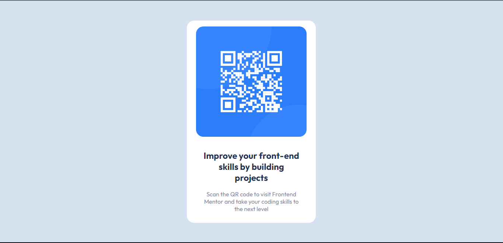
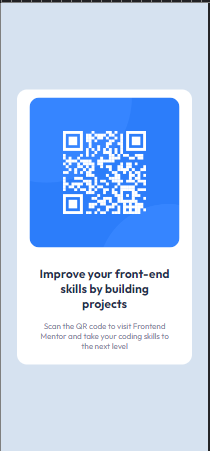

# Frontend Mentor - QR code component solution

This is a solution to the [QR code component challenge on Frontend Mentor](https://www.frontendmentor.io/challenges/qr-code-component-iux_sIO_H). Frontend Mentor challenges help you improve your coding skills by building realistic projects. 

## Table of contents

- [Overview](#overview)
  - [Screenshot](#screenshot)
  - [Links](#links)
- [My process](#my-process)
  - [What I learned](#what-i-learned)
  - [Continued development](#continued-development)
- [Author](#author)

## Overview
**The challenge**
  *Build a QR code component,identical to given design images

### Screenshot
**Desktop**

**Mobile**

### Links

- Solution URL: [Add solution URL here](https://your-solution-url.com)
- Live Site URL: [Add live site URL here](https://your-live-site-url.com)

## My process

### Built with

- HTML5
- CSS
- Flexbox

### What I learned

* I learned how to use flexbox in centering divs
* Resetting the stylesheet provided by browser for smoother personal styling.

### Continued development

- In my future solution,I want to get more comfortable with using flexbox.
- I was confused with positioning of divs during the course of this project,and hence would like to work on my basic understanding of CSS.

## Author

- Frontend Mentor - [@Pallavi2908](https://www.frontendmentor.io/profile/Pallavi2908)

